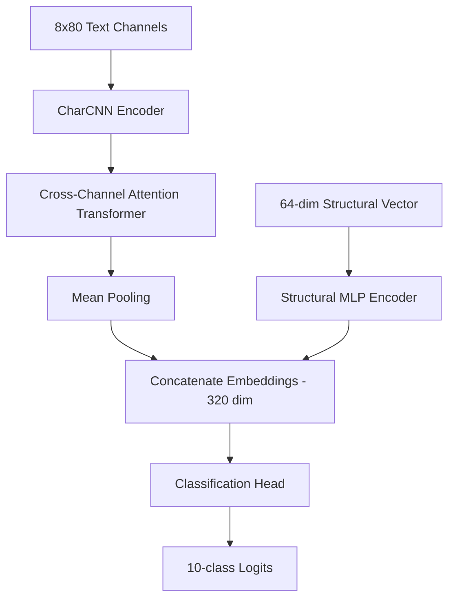

# 🌌 GhostFill — Privacy-First Local AI Autofill & Mail Alias Assistant

GhostFill is a state-of-the-art, privacy-focused Chrome Extension (Manifest V3) that provides secure, automated form completion. Unlike traditional managers, GhostFill performs all analysis locally in the user's browser using a **lightweight, quantized neural network (ONNX)**, completely eliminating cloud API keys, network hops, and data transmission to external servers.

---

## 🔑 Key Features

### 1. 🧠 100% Local AI Inference Engine (Sentinel Brain)

- **Zero Cloud Leakage**: Form fields are never sent to external servers. Field classification runs entirely in-browser via WebAssembly (ONNX Runtime Web).
- **Bayesian Multi-Layer Fusion**: Combines neural network outputs, layout heuristics, and spatial coordinate grids to resolve input contexts with extreme accuracy.
- **Active Learning Loop**: Dynamically logs edge cases (model-heuristic disagreements) locally, enabling user-driven continuous improvement.

### 2. 📬 Failover-Resilient Temporary Mail Service

- **Multi-Provider Backend**: Integrates GuerrillaMail, Mail.gw, Mail.tm, Maildrop, and TempMail.
- **Dynamic Failover**: A health manager monitors API response times and automatically routes requests to online providers if one is blocked or slow.
- **Automatic Extraction**: Scans incoming messages via SSE and Polling to extract OTPs and email verification links automatically.

### 3. 🔒 Cryptographically Secure Passwords

- Generates high-entropy random credentials locally using browser cryptography.
- Instantly matches "Confirm Password" relations on sign-up pages using layout topology.

### 4. 🎛️ Shadow DOM Floating Action Button (FAB)

- Contextual menu placed near active input fields.
- Uses Shadow DOM boundaries to prevent host site CSS from overriding or corrupting the extension's UI styles.

---

## 📁 Directory Structure

```
ghostfill-extension-main/
├── src/                    # All TypeScript/React source code
│   ├── background/         # Service worker, SSE managers, OAuth2 flows, messaging
│   ├── content/            # Content scripts, DOM observers, floating UI buttons, autofiller
│   ├── popup/              # React Popup UI & component system
│   ├── options/            # React Options & settings manager page
│   ├── offscreen/          # Offscreen document dedicated to ONNX model execution
│   ├── intelligence/       # Sentinel Brain, Bayesian Meta-Learner, Feature Extractor
│   ├── services/           # Decoupled core services (Mail API, OTP Service, Cryptography)
│   ├── shared/             # Shared constants, types, and host tokens
│   ├── utils/              # General helper functions (cleaners, safety logs, DOM helpers)
│   └── styles/             # Application visual styling, transitions, and theme
├── public/                 # Static extension files (locales, manifest.json, icons)
├── models/                 # Compiled ONNX model files (FP32 & Quantized INT8)
├── training/               # Python ML training pipeline & continuous learning datasets
├── scripts/                # Node.js build, bundle size checkers, and zip utilities
└── tests/                  # Extension integration and unit test suites
```

---

## 🧠 Sentinel Brain — Machine Learning Architecture

GhostFill relies on a hybrid classifier that reads both **structural layout features** and **text labels** to identify 10 core input classes: `Email`, `Username`, `Password`, `Target_Password_Confirm`, `First_Name`, `Last_Name`, `Full_Name`, `Phone`, `OTP`, and `Unknown`.

### 1. Feature Extraction (`extractor.ts`)

- **Text Channels (8x80 Tensor)**: Tokenizes 8 text fields surrounding the element (placeholder, aria-label, explicit labels, name/id, autocomplete attributes, floating label, nearby text, and form heading). Converts text into character codes, padded/truncated to 80 characters.
- **Structural Vector (64-dim Float)**: Normalizes DOM attributes (type mapping, autocomplete values, aspect ratio, centering, absolute viewport position, distance to nearest submit button, and tag density).

### 2. Neural Network Topology (`train_ghostfill_model.py`)



- **CharCNN Encoder**: Shared 1D convolutional layers with Group Normalization (stable at batch size = 1) mapping text features to 192-dimensional embeddings.
- **Cross-Channel Attention**: A customized multi-head self-attention module allowing character representations to exchange context across the 8 channels.
- **Structural MLP**: Layer-normalized multi-layer perceptron resolving layout features.
- **Inference Optimization**: Post-training dynamic quantization shrinks the model from **~10MB to ~2.5MB** (`QuantType.QUInt8`), ensuring instantaneous startup in Chrome's offscreen document container.

---

## 💻 Local Development & Setup

### Prerequisites

- **Node.js** (v18 or higher)
- **npm** (v9 or higher)
- **Python** (3.8 - 3.11 for training pipeline)

### 1. Web Extension Setup

Clone the repository, install dependencies, and build the extension directory:

```bash
# Install node packages
npm install

# Build the extension in development mode with automatic watch
npm run dev

# Build the final production bundles
npm run build
```

The output files will compile into the `dist/` directory.

### 2. Loading the Extension in Chrome

1. Open Google Chrome and navigate to `chrome://extensions/`.
2. Enable **Developer mode** (toggle in the top-right corner).
3. Click **Load unpacked** (top-left button).
4. Select the `dist/` folder inside the project root.

---

## 📊 Model Training & Distillation Pipeline

If you want to train, refine, or upgrade the underlying machine learning model:

```bash
# Navigate to the training directory
cd training

# Install Python requirements (requires PyTorch, ONNX, and ONNX Runtime)
pip install -r requirements.txt

# Option A: Run the baseline training, validation, and quantization script
python train_ghostfill_model.py

# Option B: Run the advanced Knowledge Distillation pipeline (Teacher-Student Ensemble)
python distill_ghostfill_model.py --teacher-epochs 50 --student-epochs 60
```

### What happens during distillation training?

1. **Teacher Training**: The pipeline trains an ensemble of 3 distinct, heavily-regularized neural network architectures (high capacity).
2. **Soft-Target Distillation**: The ensemble of teachers generates "soft labels" representing the relative probability distribution of each class (capturing subtle features/ambiguities).
3. **Student Optimization**: A lightweight, fast student model is trained under a combined loss function (hard labels + soft temperature-scaled teacher logits).
4. **Validation & Quantization**: Evaluates the distilled student model's accuracy, exports it to an FP32 ONNX format, and applies dynamic INT8 quantization (`models/ghostfill_v1_int8.onnx`) for direct use in the extension's offscreen engine.

---

## 🧪 Verification & Testing

GhostFill includes a comprehensive test suite using `vitest` for TS/React code and native Python checks for ML training environment.

```bash
# Run the TS type checker
npm run type-check

# Run unit and integration tests (93+ checks)
npm test

# Run vitest in interactive UI mode
npm run test:ui

# Verify code formatting and lint rules
npm run format:check
npm run lint
```

---

## 📄 License

GhostFill is open-source software licensed under the [MIT License](LICENSE).
