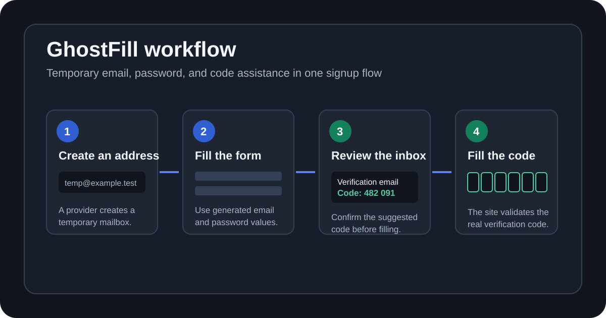

# GhostFill

GhostFill is a Chrome extension that generates disposable email addresses, creates passwords, and helps fill verification codes during a signup flow.

It is an early public build. The default package is temporary-email-only. It does not request Gmail access or require a paid API, hosting account, database, domain, or Chrome Web Store listing.



The image is an illustrative workflow diagram, not a recording. A clean local demo surface and reproducible recording procedure are in [docs/demo/RECORDING.md](docs/demo/RECORDING.md). No public recording is currently published.

## Install

There is no GitHub Release or Chrome Web Store package yet. You can [download the source](https://github.com/Xshya19/ghostfill-extension/archive/refs/heads/main.zip) and build it locally. A tagged GitHub Release will provide a verified ZIP once a maintainer creates one.

### Build from source

```bash
git clone https://github.com/Xshya19/ghostfill-extension.git
cd ghostfill-extension
npm ci
npm run type-check
npm run build:zip
```

The command creates `ghostfill-extension-v1.1.0.zip` and a matching `.sha256` checksum in the repository root. Verify the checksum before installing:

```powershell
Get-FileHash .\ghostfill-extension-v1.1.0.zip -Algorithm SHA256
Get-Content .\ghostfill-extension-v1.1.0.zip.sha256
```

Then:

1. Extract the ZIP to a permanent folder.
2. Open `chrome://extensions`.
3. Enable **Developer mode**.
4. Select **Load unpacked**.
5. Choose the extracted folder that contains `manifest.json`.

Manual installs do not receive automatic Chrome Web Store updates. Replace the extracted folder with a later verified release when one is published.

## What it does

- **Disposable email:** requests an address from one of the supported public temporary-email providers and polls its inbox.
- **Password generation:** creates a configurable password with browser cryptography and can fill it into a detected field.
- **OTP assistance:** extracts likely verification codes using deterministic text, layout, and pattern heuristics. It associates an active email session with the originating signup tab before offering a fill action.

GhostFill can also identify activation links. Automatic external-link opening is enabled by default and can be disabled under Options -> Automation. Users should still review each destination.

The extension does not guarantee that every website, provider, code format, or React form will work. Temporary-email providers are third parties and may block, rate-limit, change, or lose messages. Do not use GhostFill for banking, brokerages, password managers, sensitive accounts, or anything that needs a durable inbox.

## Privacy and permissions

The extension processes generated identities, temporary-email account state, inbox content needed for the active flow, detected verification codes, and settings in browser storage. It sends provider-specific requests to the selected temporary-email service. It does not make a disposable address a secure account boundary.

Read the project-specific details before installing:

- [Privacy policy](PRIVACY.md)
- [Permission rationale](docs/PERMISSIONS.md)
- [Security policy](SECURITY.md)

The public manifest retains broad `http` and `https` content-script matching so it can detect signup and OTP forms. It excludes a curated list of major banking, brokerage, password-manager, and Chrome Web Store domains. Those exclusions reduce exposure but are not a substitute for user judgement.

## Gmail and other real-mail integrations

The public build deliberately removes Gmail OAuth, `identity`, `scripting`, Google, Microsoft, and Zoho host access. It also hides the Gmail controls.

Maintainers can build the legacy integration profile with `npm run build:full`. It is not the public distribution path. The Gmail API uses the restricted `gmail.readonly` scope, so it requires a separately reviewed OAuth and verification plan before it can be offered to unrestricted public users. See [docs/BUILD_PROFILES.md](docs/BUILD_PROFILES.md).

## Development

```bash
npm ci
npm run type-check
npm run lint
npm test
npm run build
npm run bundle:check
npm run zip
```

The default `npm run build` creates the public temporary-email-only package. `npm run build:full` is for maintainers working on the legacy real-mail integrations.

## Release process

GitHub Actions runs type checks, lint, tests, the public production build, and the bundle-size gate on Node.js 20 and 22. A verified `v<package-version>` tag runs the release workflow, creates the ZIP and SHA-256 file, then uses GitHub-generated release notes.

The repository currently has no published release. The exact manual process is in [docs/RELEASING.md](docs/RELEASING.md).
Maintainers should also follow the [GitHub operations and recovery guide](docs/GITHUB_OPERATIONS.md) for branch protection, Actions recovery, and dependency-update handling.

## Contributing and support

- [Contributing guide](CONTRIBUTING.md)
- [Changelog](CHANGELOG.md)
- [Security reporting](SECURITY.md)
- [Issue tracker](https://github.com/Xshya19/ghostfill-extension/issues)

GhostFill is released under the [MIT License](LICENSE).
