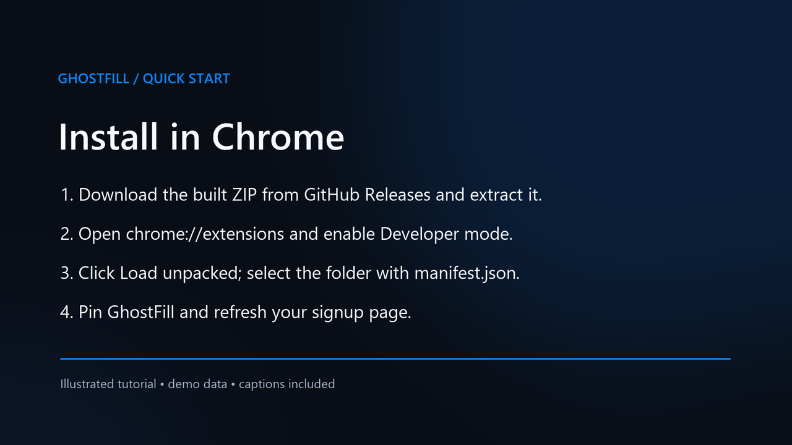

# GhostFill

GhostFill helps with signup forms: generate a temporary email address and password, fill identity fields, and receive verification codes or activation links in the extension.

**[Download the latest built ZIP](https://github.com/Xshya19/ghostfill-extension/releases/latest)** · [Install](#install) · [First use](#first-use) · [Updates](#update-an-existing-install) · [Troubleshooting](#setup-help) · [Console logs](#see-console-logs) · [Development](#development)

Free and open source. The built package runs in desktop Google Chrome on Windows, macOS, and Linux. Temporary email works without an API key, Gmail connection, Node.js, or Git.

**[Watch the 47-second quick-start video](https://github.com/Xshya19/ghostfill-extension/blob/main/docs/demo/ghostfill-quickstart.mp4)**: install GhostFill, generate an address, fill a signup form, handle verification, and enable automatic Windows updates.

[](https://github.com/Xshya19/ghostfill-extension/blob/main/docs/demo/ghostfill-quickstart.mp4)

The video is a captioned illustration using demo data. Jump to **0:00** for installation, **0:10** for the signup workflow, **0:22** for verification, or **0:35** for automatic updates. [Text instructions](#install) and [captions](docs/demo/ghostfill-quickstart.vtt) are also available.

## What it does

| Feature            | How it works                                                                                                |
| ------------------ | ----------------------------------------------------------------------------------------------------------- |
| Temporary email    | Generate an address and check its inbox. GhostFill can try another provider when address generation fails.  |
| Form filling       | Fill generated names, email addresses, usernames, and passwords through the floating button or Smart Fill.  |
| Verification codes | Detect likely one-time codes, preserve leading zeros, and attempt to fill the matching signup form.         |
| Activation links   | Evaluate verification links and open an approved destination in a new tab when appropriate.                 |
| Optional Gmail     | In the full build, connect an authorized Gmail account for inbox access and site-specific dot/plus aliases. |

Code extraction uses local text, layout, and pattern analysis. It does not require a paid AI service. Detection and automatic actions can fail on unfamiliar forms or messages; codes and links remain available for manual use.

Temporary inboxes depend on third-party providers and can expire. Websites can reject disposable addresses, including work-email fields. Use a durable inbox for accounts you need to keep or recover.

Providers that fail a current API check are excluded from automatic fallback until a later check recovers. Unsupported legacy integrations, including the current Mailinator and YOPmail adapters, are no longer offered for new inboxes. Tempmail.plus now uses its published receiving domains, starting with `mailto.plus`. API availability does not prove delivery from a particular signup site. See the [provider findings and diagnostic commands](docs/PROVIDER_AUDIT.md).

## Install

### 1. Get the extension folder

1. Open the [latest release](https://github.com/Xshya19/ghostfill-extension/releases/latest) and expand **Assets** if it is collapsed.
2. Download **`ghostfill-extension-v<version>.zip`** and its matching **`.zip.sha256`** file. The version number is part of the filename.
3. Extract the ZIP into a permanent folder, for example **Documents → GhostFill**.
4. Open the extracted folder. It must contain **`manifest.json`**, **`popup.html`**, and **`background.js`** together. If extraction created another folder inside it, open that inner folder.
5. Follow **Load it in Chrome** below.

**Choose the built ZIP from Assets.** GitHub's **Source code (zip)** and **Code → Download ZIP** contain source files that must be built first; see [Development](#development).

<details>
<summary>Check the downloaded ZIP's checksum</summary>

Run the command for your computer in the folder containing the downloaded ZIP and checksum. Keep the matching files together.

**Windows (PowerShell):**

```powershell
Get-FileHash -Path .\ghostfill-extension-v*.zip -Algorithm SHA256
```

**macOS:**

```bash
shasum -a 256 ghostfill-extension-v*.zip
```

**Linux:**

```bash
sha256sum --check ghostfill-extension-v*.zip.sha256
```

On Windows and macOS, compare the displayed hash with the 64-character hash in the matching `.zip.sha256` file. On Linux, expect the ZIP filename followed by **OK**. If they differ, download both files again before installing.

</details>

### 2. Load it in Chrome

1. Type **`chrome://extensions`** into Chrome's address bar and press Enter.
2. Turn on **Developer mode** in the top-right corner.
3. Click **Load unpacked**.
4. Select the extracted folder containing `manifest.json`. If you built from source, select the project's **`dist`** folder.
5. Confirm the **GhostFill** card appears and its switch is on.
6. Click Chrome's **Extensions** puzzle icon and pin GhostFill to the toolbar.
7. Refresh any signup page that was already open, then click the GhostFill toolbar icon.

Keep the installed folder in the same location. Chrome loads the unpacked extension from that folder. These steps follow [Chrome's unpacked-extension installation guide](https://developer.chrome.com/docs/extensions/get-started/tutorial/hello-world#load-unpacked).

## First use

1. Open the site's signup page, then open GhostFill from the toolbar.
2. Select **Temp mail** and generate an address. Use the floating button to fill the email field, or copy and paste the address.
3. Fill the other required fields and ask the site to send its verification email. Keep the signup tab open.
4. GhostFill checks the active inbox. When a matching fresh code arrives, it attempts to fill the verification field.
5. Open the inbox message to review it. The blue **Copy** button shows the detected code and preserves leading zeros; **Open verification link** opens the detected destination in a new tab.

Open **Options** using the gear button in the popup. Settings save automatically; wait for **Saved** before closing the page.

### Codes and activation links

**Options → Automation** contains **Auto-fill OTP codes** and **Auto-open verification links**. Both are enabled by default.

- **A message contains a code and a link:** GhostFill first attempts to fill a matching code field. A successful fill leaves the alternative link available in the message reader.
- **A matching code form is unavailable or filling fails:** an approved verification link can open in a new tab.
- **A verification field appears later:** GhostFill can resume filling a fresh approved code.
- **The message or destination is uncertain:** review it and use the copy or open-link controls yourself.

Automatic actions use the active signup context, message freshness, sender/site evidence, and code or link checks. Enabling automation does not mean every detected number or URL will be used.

### Names, email fields, and senders

GhostFill distinguishes first name, last name, and full name using field attributes, labels, and nearby context. Work, personal, school, and confirmation email fields use the address in the selected identity. Filling a work-email field does not make a disposable address acceptable to that site. Ambiguous fields and fields asking for another person's name stay unfilled.

Sender labels use provider metadata or decoded email headers. For a bounce address, GhostFill can infer a product from matching subject and website evidence. When evidence is missing or ambiguous, it shows a domain label or **Unknown sender**. A display name alone does not establish trust.

### Driftz domain preference

The default provider is **Driftz**. GhostFill requests **`bbjbinin.mn`** by default and checks the domain of the returned address.

It makes **up to three attempts total** if the returned domain differs, for example `manornewtech.org`. If it still cannot obtain the requested domain, provider fallback can take over. An explicitly selected domain is respected.

Domain availability and website acceptance can change. This preference does not guarantee that a signup site will accept the address.

## Update an existing install

Open **GhostFill → Options → About → Updates** and click **Check for updates**. In the Gmail-enabled build, a newer stable release shows links to its built ZIP and matching checksum. A local build newer than the published version is not offered a downgrade.

The built ZIP on GitHub Releases uses the **full profile**, which includes optional Gmail integration. If you installed the temporary-email-only profile, use a package built with that same profile; see [Package options](#package-options).

### Windows: use the included updater

For **automatic updates**, open your installed GhostFill folder and double-click **`Enable Automatic Updates.cmd`** once. For a source install, use the shortcut in the project folder; it targets `dist`. Keep that folder in the same location. The helper runs as your Windows user, needs no administrator access, and checks the latest stable GitHub release every six hours while you are signed in. It verifies the built ZIP and checksum before replacing files, rejects downgrades and mismatched build profiles, and retains a backup for rollback.

GhostFill checks the installed update status every five minutes. It waits for verification work and storage writes to finish and for its popup and Options page to close before loading a newer version. Refresh signup tabs afterward so they receive the new content script. Chrome 109–113 can receive the files but need a manual reload or browser restart; automatic reload requires Chrome 114 or later. Reloading an unpacked extension uses [Chrome's runtime reload API](https://developer.chrome.com/docs/extensions/reference/api/runtime#method-reload).

**Options → About → Updates** shows whether the helper is enabled, its last check, and any newer installed version waiting to load. Run **`Disable Automatic Updates.cmd`** in the same folder to remove this installation's scheduled task. Automatic updates currently support Windows and the full build published on GitHub Releases. A temporary-email-only installation needs a matching package from its maintainer.

The setup creates one task named `GhostFill-AutoUpdate-…` for your user and installed folder. The helper's bounded activity log is `.ghostfill-auto-GhostFill-AutoUpdate-….log` beside that folder; it contains update status, not inbox data. If checks stop, run the Enable shortcut again and refresh the status. Disabling stops future checks; it does not undo an update already installed.

To update manually:

Finish your current signup before updating. The updater needs PowerShell and a writable installation folder; it does not need Node.js or Git.

1. Open your installed GhostFill folder and double-click **`Update GhostFill.cmd`**. For a source installation, this shortcut is also available in the project folder and updates its `dist` folder.
2. Wait for it to check the latest stable release, download a newer built ZIP, verify the checksum, and apply the files.
3. Open **Options → About → Updates** and click **Reload after updating**, or click the circular **Reload** arrow on GhostFill's card at `chrome://extensions`.
4. Refresh your signup tabs and confirm the new version on GhostFill's extension card.

The updater keeps the installation path and extension identity, retains a backup beside the installed folder, and attempts to restore it if replacement fails. **No newer published version** means your installed version is already current or newer.

To install a package you already downloaded, save the ZIP and its matching `.zip.sha256` file together, then drag the **ZIP** onto `Update GhostFill.cmd`. The updater rejects older versions, incomplete packages, checksum mismatches, and changes between build profiles.

The shortcut uses a process-only PowerShell execution-policy setting. If your computer's policy blocks it, follow the manual steps below.

### macOS, Linux, or an older installation without the updater

1. Download the newer built ZIP and matching checksum for your existing build profile.
2. Expand **Check the downloaded ZIP's checksum** in the [installation section](#1-get-the-extension-folder) and run the command for your computer.
3. Extract the new ZIP into a separate folder.
4. Back up your current installed folder, then copy the new extension files **into that same installed folder**, replacing matching files.
5. Click **Reload** on GhostFill at `chrome://extensions` and refresh your signup tabs.

Keep GhostFill installed in Chrome during the update so its extension settings remain associated with the same installation.

**Check for updates** checks release information. **Reload after updating** loads files already on your computer. Apply the new files using the updater or manual steps before reloading. Chrome's [standard extension update lifecycle](https://developer.chrome.com/docs/extensions/develop/concepts/extensions-update-lifecycle) does not replace these unpacked-folder update steps.

The Windows updater changes built installation files. Developers must update their source checkout separately before rebuilding.

## Setup help

| What you see                                           | What to do                                                                                                                                                                               |
| ------------------------------------------------------ | ---------------------------------------------------------------------------------------------------------------------------------------------------------------------------------------- |
| Chrome cannot load the manifest or a script is missing | Select the folder containing the built `manifest.json`, `popup.html`, and `background.js`. Build a source ZIP first.                                                                     |
| GhostFill opens, but no floating button appears        | Refresh the signup page after installation or reload. Internal Chrome pages, the Chrome Web Store, and excluded sites do not allow the form tools.                                       |
| A field is missed or detected incorrectly              | Use manual copy/paste for that field. Report the site and field label through the [issue tracker](https://github.com/Xshya19/ghostfill-extension/issues) with redacted logs.             |
| The site rejects a temporary email address             | Try another provider or use a durable address. A work-email requirement may reject disposable domains.                                                                                   |
| No verification email arrives                          | Open the active inbox, wait briefly, and request a fresh email on the site. Provider availability and site delivery can vary.                                                            |
| A code is visible but the site is not filled           | Keep the matching signup tab open, check **Options → Automation**, then use the message's blue **Copy** button and paste the code.                                                       |
| An activation link does not open automatically         | Check **Auto-open verification links** under **Options → Automation**. Review the destination and use **Open verification link** manually when appropriate.                              |
| Updating appears to change nothing                     | Apply the package first, reload GhostFill, and refresh the signup tabs. Reload alone does not download files.                                                                            |
| The updater reports a checksum or profile mismatch     | Download the ZIP and checksum from the same release and use the same build profile as your current installation.                                                                         |
| Gmail sign-in is unavailable or fails                  | The full build needs a configured OAuth client and an account permitted by that client's consent setup. Temporary email remains available. See [Gmail setup](#gmail-and-google-aliases). |
| `npm` is not recognized / command not found            | For a source build, install Node.js 24 LTS and reopen the terminal. On Windows use `npm.cmd`.                                                                                            |
| PowerShell blocks `npm.ps1`                            | Use `npm.cmd` for the build commands; changing the system execution policy is unnecessary.                                                                                               |
| npm reports `ENOENT` or missing `package.json`         | Open the terminal in the extracted source folder containing `package.json`.                                                                                                              |

## See console logs

1. Open **Options → Advanced**, enable **Debug logging**, and wait for **Saved**.
2. Open the console for the part you are investigating:

   | Part                                     | Where to open its console                                                                               |
   | ---------------------------------------- | ------------------------------------------------------------------------------------------------------- |
   | Inbox, providers, verification decisions | Open `chrome://extensions`, find GhostFill, and click its **service worker** link.                      |
   | Floating button and form filling         | Open Developer Tools on the signup page: **F12** on Windows/Linux or **Option + Command + I** on macOS. |
   | Popup                                    | Open GhostFill, right-click inside the popup, and choose **Inspect**.                                   |
   | Options page                             | Right-click the Options page and choose **Inspect**.                                                    |

3. In **Console**, enable **Preserve log**, filter for **`GhostFill`**, and repeat the action.

Debug mode prints detailed messages at the normal console level; enabling **Verbose** is unnecessary. The setting stays enabled after a browser restart. Turn it off when finished; routine information, warnings, and errors remain visible.

Passwords, tokens, codes, and URL query/fragment values are masked by the logger. Review and redact private information before sharing logs, screenshots, or inbox messages.

## Gmail and Google aliases

Gmail is optional and available in the full build. You can use temporary email without setting it up.

1. Open **Options → Email → Gmail (OAuth)**.
2. Enter and save a valid OAuth client ID supplied by the maintainer or configured for your own Google project.
3. Select **Gmail** in the popup and connect an account allowed by that OAuth client's setup.
4. Use **Aliases** to manage site-specific Gmail dot/plus aliases.

Google handles OAuth sign-in. Gmail inbox access uses the restricted [`gmail.readonly` scope](https://developers.google.com/workspace/gmail/api/auth/scopes). Public Gmail-enabled distribution requires the appropriate OAuth consent configuration and any applicable Google verification or security assessment. Publishing a ZIP on GitHub does not complete that setup.

See [Build profiles](docs/BUILD_PROFILES.md) for the integration requirements.

## Package options

| Profile                            | Build command              | Included features                                                 |
| ---------------------------------- | -------------------------- | ----------------------------------------------------------------- |
| Full (default; GitHub release ZIP) | `npm run build:zip`        | Temporary email and optional Gmail OAuth/inbox/alias integration. |
| Temporary-email-only               | `npm run build:public:zip` | Temporary email without Gmail OAuth permissions or controls.      |

Both commands create `dist`, a versioned ZIP, and its `.zip.sha256` checksum. Choose the profile before installing, and keep the same profile when updating.

## Privacy and permissions

GhostFill processes generated identities, passwords, mailbox state, verification messages, and settings in browser storage. Address generation and inbox checks send requests to the selected email provider. Update checks contact GitHub; optional Gmail sign-in and inbox access contact Google.

The content script matches many HTTP/HTTPS pages to detect forms. The manifest excludes a curated list of banking, brokerage, password-manager, and Chrome Web Store domains. Do not use GhostFill for financial services, password managers, or sensitive accounts. Use a durable inbox for accounts you need to keep or recover.

Read the [privacy policy](PRIVACY.md), [permission rationale](docs/PERMISSIONS.md), and [security policy](SECURITY.md).

## Preview

<details>
<summary>See the illustrated GhostFill workflow</summary>


Watch the [19-second MP4](docs/demo/ghostfill-showcase.mp4) or view the [still poster](docs/demo/ghostfill-showcase-poster.png). This is an illustrated workflow. Recording instructions and the render script are in [docs/demo](docs/demo/RECORDING.md).

</details>

## Development

The project uses TypeScript, React, native CSS, Webpack, and Vitest. Use **[Node.js 24 LTS](https://nodejs.org/en/download), version 24.15.0 or newer within the 24.x line**, with npm. The repository's `.nvmrc` selects Node 24.

1. [Download the source ZIP](https://github.com/Xshya19/ghostfill-extension/archive/refs/heads/main.zip), or clone the repository if you use Git.
2. Extract it to a permanent folder and open the inner folder containing `package.json`.
3. Open a terminal there. On Windows, right-click an empty area of the folder and choose **Open in Terminal**. On macOS or Linux, open Terminal, type `cd `, drag the source folder into the terminal, and press Enter.
4. Run the following commands one at a time:

   **Windows (PowerShell or Command Prompt):**

   ```powershell
   npm.cmd ci
   npm.cmd run build:zip
   ```

   **macOS / Linux:**

   ```bash
   npm ci
   npm run build:zip
   ```

5. Load the generated **`dist`** folder using the [Chrome installation steps](#2-load-it-in-chrome).

The built ZIP beside `package.json` can be installed without Node.js. For local development, update your source checkout before rebuilding; the installation updater does not update source files.

| Check                               | Command                                   |
| ----------------------------------- | ----------------------------------------- |
| Workflow policy                     | `npm run workflow:check`                  |
| Types                               | `npm run type-check`                      |
| Lint                                | `npm run lint`                            |
| Tests                               | `npm test`                                |
| Local extraction benchmark          | `npm run benchmark:extraction`            |
| Production build                    | `npm run build`                           |
| Bundle size limits (after building) | `npm run bundle:check`                    |
| Package the current build           | `npm run zip`                             |
| Windows installer/updater checks    | `node scripts/check-extension-update.cjs` |
| Windows automatic-update checks     | `node scripts/check-auto-updates.cjs`     |

Use `npm.cmd` in place of `npm` in PowerShell if script execution is blocked. Dependency compatibility limits are documented in [GitHub operations](docs/GITHUB_OPERATIONS.md).

See the [backend audit and performance measurements](docs/BACKEND_PERFORMANCE.md) for request-count comparisons, cache limits, session recovery changes, and regression commands. The benchmark uses local fixtures and makes no requests to email providers.

## Release process

GitHub Actions is disabled for this repository. Code can be pushed and reviewed without remote CI/CD. Maintainers run the local checks listed above, build the extension, and publish the ZIP and matching checksum through GitHub Releases.

Pushing a version tag does not publish a release automatically in this mode. Follow [Releasing GhostFill](docs/RELEASING.md) to upload the built package and keep the Windows updater working. The CI, security, and release workflow files remain available for optional future use; [GitHub operations](docs/GITHUB_OPERATIONS.md) explains the repository settings and how to re-enable them.

## Contributing and support

- [Contributing guide](CONTRIBUTING.md)
- [Changelog](CHANGELOG.md)
- [Report a bug](https://github.com/Xshya19/ghostfill-extension/issues)
- [Report a security issue privately](SECURITY.md)

When reporting a bug, include the extension version, browser version, site, expected behavior, and what happened. Attach redacted logs if possible. Keep passwords, verification codes, private messages, and activation URLs out of public reports.

GhostFill is released under the [MIT License](LICENSE).
