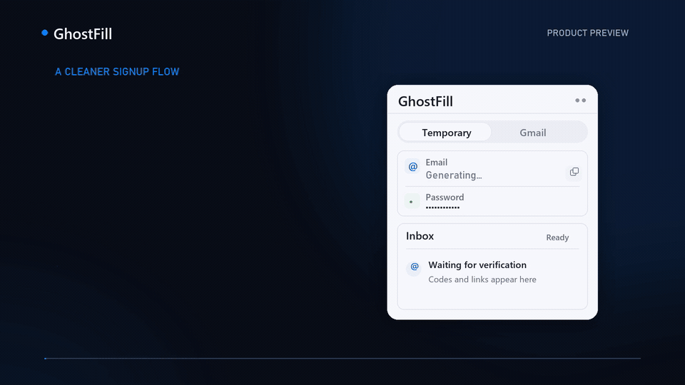

# GhostFill

GhostFill is a Chrome extension that generates disposable email addresses, creates passwords, and helps fill verification codes during a signup flow.

It is an early build. The default package includes temporary email plus the optional Gmail/Google alias and inbox integration. It does not require a paid API, hosting account, database, domain, or Chrome Web Store listing.



Watch the [19-second MP4 showcase](docs/demo/ghostfill-showcase.mp4) or view the [still poster](docs/demo/ghostfill-showcase-poster.png). This is an illustrated workflow, not a screen recording. Regenerate it with the [render script](docs/demo/build-showcase.py). A clean local demo surface and recording procedure are in [docs/demo/RECORDING.md](docs/demo/RECORDING.md).

The Gmail alias scene shows the optional full integration profile. The default public package is temporary-email-only and does not request Gmail access.

**Start here:** [Install GhostFill](#install) → [Try your first signup](#first-use) → [Update GhostFill](#update-an-existing-install) → [Fix a setup problem](#setup-help).

## Install

Use **Google Chrome on a desktop computer** (Windows, macOS, or Linux). Temporary email works without connecting Gmail or entering an API key.

### 1. Get the extension folder

**Already have a built GhostFill ZIP?** Extract it to a permanent folder, such as `Documents/GhostFill`. Open that folder: you should see `manifest.json`, `popup.html`, and `background.js` together. Continue to step 2. You do not need Node.js to install a built ZIP.

**Need a built ZIP?** Check the [Releases page](https://github.com/Xshya19/ghostfill-extension/releases). Published packages may be older than this checkout and may use a different build profile; check the release notes before choosing one.

**Installing from this repository?** Build the source once using these steps; no coding or Git is required:

1. Install [Node.js](https://nodejs.org/en/download) **22 LTS**, including npm. Close and reopen your terminal after installation.
2. [Download the source ZIP](https://github.com/Xshya19/ghostfill-extension/archive/refs/heads/main.zip). Extract it to a permanent folder, then open the inner `ghostfill-extension-main` folder containing `package.json`.
3. Open a terminal **in that folder**. On Windows, right-click an empty area of the folder and choose **Open in Terminal**. On macOS or Linux, open Terminal, type `cd `, drag the folder into the terminal, and press Enter.
4. Run the two commands for your computer, one at a time. Wait for each to finish:

   **Windows (PowerShell or Command Prompt):**

   ```powershell
   npm.cmd ci
   npm.cmd run build:zip
   ```

   **macOS / Linux:**

   ```bash
   npm ci
   npm run build:zip
   ```

5. When the build succeeds, open the newly created **`dist` folder**. This is the extension folder to select in Chrome. Keep the project folder in its permanent location.

The build also creates `ghostfill-extension-v<version>.zip` and its `.sha256` checksum beside `package.json`. The ZIP contains the built extension and can be shared for installation without Node.js. **GitHub's source ZIP still needs the build steps above.**

### 2. Load it in Chrome

1. Type `chrome://extensions` into Chrome's address bar and press Enter.
2. Turn on **Developer mode** in the top-right corner.
3. Click **Load unpacked**.
4. Select the **`dist` folder** if you built from source, or the extracted **built ZIP folder** if someone gave you a package. Select the folder, not the ZIP file. Do not select the source project folder.
5. Confirm that a **GhostFill** card appears and its switch is on.
6. Click Chrome's **Extensions** puzzle icon, then click the pin next to **GhostFill**. Click the GhostFill toolbar icon to open its popup.

These are Chrome's standard [local extension installation steps](https://developer.chrome.com/docs/extensions/get-started/tutorial/hello-world#load-unpacked).

### First use

1. Open the signup page you want to use, then open the GhostFill popup.
2. Choose temporary email and generate an address. Copy it into the site's email field, or use the floating fill button next to the field.
3. Request the verification email on the site and keep the signup tab open. GhostFill checks the active inbox and attempts to fill a matching verification code.
4. Open the inbox message to review its code and any verification link. The blue **Copy [code]** button preserves leading zeros; **Open verification link** opens the detected link in a new tab.

**Setup worked** when the popup opens, an address is generated, and its inbox can be opened. Email arrival and acceptance depend on the mail provider and the signup site.

Driftz requests **`bbjbinin.mn` by default**. GhostFill checks the returned address and retries up to three times if Driftz returns another domain, such as `manornewtech.org`. If the requested domain remains unavailable, it uses the existing provider fallback instead of retrying forever. An explicitly selected domain is still respected. A domain's acceptance depends on the signup site.

Automatic code filling and verification-link opening are enabled by default. Change them under **Options → Automation**. A message containing both a code and a link uses the code when it can fill the waiting form. If there is no matching code form, or filling fails, an approved verification link can open in a new tab. A successful code fill keeps the alternative link available in the reader without opening another tab.

Automatic actions require a matching sender and signup site, a fresh unused code, or a verified activation destination. Uncertain codes and links stay available for review. If a verification field appears after its email arrives, GhostFill can resume filling a fresh approved code.

Sender names come from the provider's sender metadata or decoded email header. When a message has only a bounce address, GhostFill can resolve a product mentioned in both the subject and its website links. This works without a brand-name list; missing or ambiguous evidence uses a domain label or **Unknown sender**. The visible label does not establish trust for automatic actions.

Form detection distinguishes first name, last name, and full name, including common labels and framework identifiers. Work, personal, school, and confirmation email fields use the email in your currently selected identity; GhostFill does not invent separate addresses for them. Ambiguous fields and fields asking for another person's name stay unfilled.

Gmail is optional. Start with temporary email, then follow [Gmail and Google aliases](#gmail-and-google-aliases) if you need that integration.

### Setup help

| What you see                                          | What to do                                                                                                                                                                |
| ----------------------------------------------------- | ------------------------------------------------------------------------------------------------------------------------------------------------------------------------- |
| `npm` is not recognized / command not found           | Install Node.js, reopen the terminal, and try again. On Windows use `npm.cmd` as shown above.                                                                             |
| PowerShell says scripts are disabled                  | Use `npm.cmd`; you do not need to change your execution policy.                                                                                                           |
| `package.json` is missing / npm reports `ENOENT`      | Open the terminal in the extracted project folder containing `package.json`, then rerun the commands.                                                                     |
| Chrome cannot load the manifest / a script is missing | Select `dist` after a successful build, or the extracted built ZIP folder. Loading the source folder will not work.                                                       |
| GhostFill is installed but no floating button appears | Refresh the signup page after installation. Chrome's internal pages, the Web Store, and excluded sites do not allow GhostFill's form tools.                               |
| No verification email arrives                         | Check the GhostFill inbox, wait briefly, then request a new code on the site. If the site rejects the temporary address, try another provider or an optional Gmail alias. |
| A code is visible but the site is not filled          | Click the blue **Copy [code]** button in the message reader and paste it into the site. Check **Options → Automation** and refresh the signup page.                       |

### Update an existing install

**Windows: double-click to update — no Node.js, Git, or administrator account needed.**

1. Open your permanent GhostFill folder and double-click **`Update GhostFill.cmd`**. For a source install, this shortcut is in the project folder; it updates the built `dist` installation.
2. Wait for the shortcut to check the latest stable [GitHub release](https://github.com/Xshya19/ghostfill-extension/releases), download a newer built ZIP, verify its SHA-256 checksum, and apply it. If it says **No newer published version**, your installed version stays as it is.
3. Open `chrome://extensions`, click **Reload** on GhostFill, then **refresh your signup tabs**. Chrome still needs this reload for a local installation.

The shortcut keeps the installation at the same path and checks its extension identity, so you can update without removing GhostFill or resetting its browser settings. It keeps a backup named `.ghostfill-backup-<version>-<id>` beside the installed folder and restores the old folder if replacement fails. Keep the installed folder in its permanent location. Updates run when you launch the shortcut; they do not run in the background.

**Have a newer ZIP from the maintainer instead?** Save the built ZIP and its matching `.zip.sha256` file together. Drag the **ZIP** onto `Update GhostFill.cmd`, then reload GhostFill in Chrome. This also works for a rebuilt package with the same version number. The updater rejects older versions, incomplete packages, and changes between the Gmail-enabled and temporary-email-only profiles.

The Windows shortcut runs the included PowerShell updater with a process-only execution-policy setting; it does not change your system's execution policy. If a managed computer blocks the shortcut, use the manual steps below.

**macOS / Linux, or an older installation without the shortcut:**

1. Download the newer **built** ZIP and its checksum from the release page or your maintainer. Use the same build profile as your current installation.
2. Verify the checksum: on macOS run `shasum -a 256 <ZIP filename>`; on Linux run `sha256sum -c <ZIP filename>.sha256`. On Windows use `Get-FileHash -Algorithm SHA256 <ZIP filename>` and compare it with the checksum file. Quote filenames containing spaces.
3. Extract the ZIP into a separate folder. Copy your current installed folder to a backup, then copy the new extension files **into the existing installed folder**, replacing matching files. Do not remove GhostFill from Chrome or load it from a new location.
4. Click **Reload** on GhostFill in `chrome://extensions` and refresh your signup tabs. Confirm the displayed version matches the downloaded package.

The shortcut updates the built installation. If you also develop GhostFill, update your source checkout separately before rebuilding it. A local build can be newer than the latest published release; the shortcut will not replace it with an older release.

### See console logs

Open **GhostFill → Options → Advanced**, turn on **Debug logging**, and wait for **Saved**. Changes save automatically. The saved setting applies to open extension pages and signup tabs, and stays enabled after a browser restart. Turn it off when finished; routine information, warnings, and errors remain visible.

- **Inbox and verification decisions:** open `chrome://extensions`, find GhostFill, and click its **service worker** link.
- **Floating button and form filling:** open Developer Tools on the signup page (**F12** on Windows/Linux, **Option + Command + I** on macOS).
- **Popup:** open GhostFill, right-click inside the popup, and choose **Inspect**.

In each **Console**, turn on **Preserve log** and filter for `GhostFill`. Debug mode prints detailed logs at the ordinary console level, so enabling **Verbose** is unnecessary. Repeat the action that failed. Logs stay in your browser; sensitive values and URL query/fragment values are masked. Review logs before sharing them.

See the [October 1 reliability audit](docs/RELIABILITY_AUDIT_2026-10-01.md) for the reported failures, fixes, verification results, and remaining compatibility limits.

### Package options

The default build includes temporary email and optional Gmail OAuth integration. If you want a temporary-email-only package without Google OAuth permissions, replace `build:zip` with `build:public:zip` in the build command. See [build profiles](docs/BUILD_PROFILES.md).


Watch the [19-second MP4 showcase](docs/demo/ghostfill-showcase.mp4) or view the [still poster](docs/demo/ghostfill-showcase-poster.png). This is an illustrated workflow, not a screen recording. Regenerate it with the [render script](docs/demo/build-showcase.py). A clean local demo surface and recording procedure are in [docs/demo/RECORDING.md](docs/demo/RECORDING.md).

## Problems it solves

- **Disposable email providers fail:** GhostFill supports multiple temporary-email providers and tries another when address generation fails.
- **Signup forms take repetitive typing:** Smart Fill detects and fills username, email, and password fields. It can generate a temporary address and password when needed.
- **Email verification interrupts signup:** GhostFill checks for verification emails, extracts likely one-time codes, and can fill the matching form. It can also open detected activation links in a new tab.
- **Some sites reject disposable domains:** In the full build, use a site-specific Gmail dot/plus alias instead. Messages sent to that alias arrive in your Gmail inbox.

## What it does

- **Disposable email:** requests an address from one of the supported public temporary-email providers and polls its inbox.
- **Password generation:** creates a configurable password with browser cryptography and can fill it into a detected field.
- **OTP assistance:** extracts likely verification codes using deterministic text, layout, and pattern heuristics. It associates an active email session with the originating signup tab and can automatically fill matching fields (enabled by default).

GhostFill can also identify activation links. **Auto-open verification links** is enabled by default and opens detected links in a new tab. Turn it off under **Options → Automation** if you prefer to open links yourself; use automatic opening only with inboxes you trust.

The extension does not guarantee that every website, provider, code format, or React form will work. Temporary-email providers are third parties and may block, rate-limit, change, or lose messages. Do not use GhostFill for banking, brokerages, password managers, sensitive accounts, or anything that needs a durable inbox.

## Privacy and permissions

The extension processes generated identities, temporary-email account state, inbox content needed for the active flow, detected verification codes, and settings in browser storage. It sends provider-specific requests to the selected temporary-email service. It does not make a disposable address a secure account boundary.

Read the project-specific details before installing:

- [Privacy policy](PRIVACY.md)
- [Permission rationale](docs/PERMISSIONS.md)
- [Security policy](SECURITY.md)

The extension manifest retains broad `http` and `https` content-script matching so it can detect signup and OTP forms. It excludes a curated list of major banking, brokerage, password-manager, and Chrome Web Store domains. Those exclusions reduce exposure but are not a substitute for user judgement.

## Gmail and Google aliases

The default build includes the Gmail integration. Open **Options → Gmail (OAuth)** to confirm the OAuth client ID, then select **Gmail** in the popup and connect your Google account. The **Aliases** button opens the site-specific Gmail alias manager; entering a domain produces the deterministic dot/plus alias used for that site.

The Gmail API uses the restricted `gmail.readonly` scope, so an unrestricted public release requires a separately reviewed OAuth client, consent-screen configuration, privacy policy, and any Google review or verification that applies at that time. See [docs/BUILD_PROFILES.md](docs/BUILD_PROFILES.md).

The restricted temporary-email-only package remains available explicitly with `npm run build:public` or `npm run build:public:zip`.

## Development

```bash
npm ci
npm run type-check
npm run lint
npm test
npm run build
npm run bundle:check
npm run zip
```

The default `npm run build` creates the full profile. `npm run build:public` creates the restricted temporary-email-only profile, and `npm run build:full` is retained as a compatibility alias.

## Release process

GitHub Actions runs type checks, lint, tests, the full production build, and the bundle-size gate on Node.js 20 and 22. A verified `v<package-version>` tag runs the release workflow, creates the full-profile ZIP and SHA-256 file, then uses GitHub-generated release notes.

Available packages are listed on [GitHub Releases](https://github.com/Xshya19/ghostfill-extension/releases). The exact maintainer process is in [docs/RELEASING.md](docs/RELEASING.md).
Maintainers should also follow the [GitHub operations and recovery guide](docs/GITHUB_OPERATIONS.md) for branch protection, Actions recovery, and dependency-update handling.

## Contributing and support

- [Contributing guide](CONTRIBUTING.md)
- [Changelog](CHANGELOG.md)
- [Security reporting](SECURITY.md)
- [Issue tracker](https://github.com/Xshya19/ghostfill-extension/issues)

GhostFill is released under the [MIT License](LICENSE).
